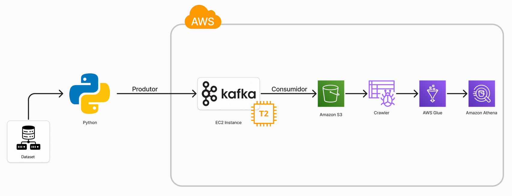

# Projeto de engenharia de dados em tempo real do mercado de ações Kafka

## Introdução
Projeto de Engenharia de Dados de Ponta a Ponta em Dados do Mercado de Ações em Tempo Real usando Kafka.

Usaremos diferentes tecnologias, como Python, Amazon Web Services (AWS), Apache Kafka, Glue, Athena e SQL.

## Arquitetura


## Tecnologia Utilizada
- Python
- Amazon Web Service (AWS)
  1. S3 (Simple Storage Service)
  2. Athena
  3. Glue Crawler
  4. Glue Catalog
  5. EC2
- Apache Kafka

## Conjunto de dados usado
- https://www.kaggle.com/datasets/jacksoncrow/stock-market-dataset

## Passo a Passo: Inicializando o Servidor Kafka

### 1. Fazer o download e extrair o Kafka
Execute os comandos abaixo para baixar e descompactar o Apache Kafka:
```bash
wget https://downloads.apache.org/kafka/3.6.2/kafka_2.13-3.6.2.tgz
tar -xvf kafka_2.13-3.6.2.tgz
```

### 2. Verificar e instalar o Java
Verifique se o Java está instalado:
```bash
java -version
```
Caso não esteja instalado, use o comando abaixo para instalar:
```bash
sudo yum install java-1.8.0-openjdk
java -version
```

### 3. Iniciar o ZooKeeper
Navegue para a pasta do Kafka:
```bash
cd kafka_2.13-3.6.2
```
Inicie o ZooKeeper com o comando:
```bash
bin/zookeeper-server-start.sh config/zookeeper.properties
```

### 4. Iniciar o Servidor Kafka
Abra uma nova janela do terminal (ou sessão SSH), configure as opções de heap e inicie o servidor Kafka:
```bash
export KAFKA_HEAP_OPTS="-Xmx256M -Xms128M"
cd kafka_2.13-3.6.2
bin/kafka-server-start.sh config/server.properties
```

Se for necessário configurar o Kafka para rodar em um IP público, edite o arquivo `server.properties`:
```bash
sudo nano config/server.properties
```
Altere a linha `ADVERTISED_LISTENERS` para incluir o IP público da instância EC2.

### 5. Criar um Tópico
Crie um tópico no Kafka executando:
```bash
cd kafka_2.13-3.6.2
bin/kafka-topics.sh --create --topic demo_testing2 --bootstrap-server {IP EC2}:9092 --replication-factor 1 --partitions 1
```

### 6. Iniciar um Produtor
Inicie um produtor Kafka para enviar mensagens para o tópico criado:
```bash
bin/kafka-console-producer.sh --topic demo_testing2 --bootstrap-server {IP EC2}:9092
```

### 7. Iniciar um Consumidor
Em outra janela do terminal, inicie um consumidor Kafka para receber mensagens do tópico:
```bash
cd kafka_2.13-3.6.2
bin/kafka-console-consumer.sh --topic demo_testing2 --bootstrap-server {IP EC2}:9092
```

---

Esse guia detalha cada etapa necessária para configurar e rodar o Apache Kafka em um ambiente EC2, facilitando a execução do projeto em tempo real.
